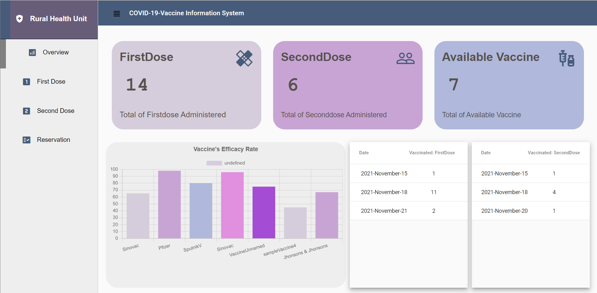
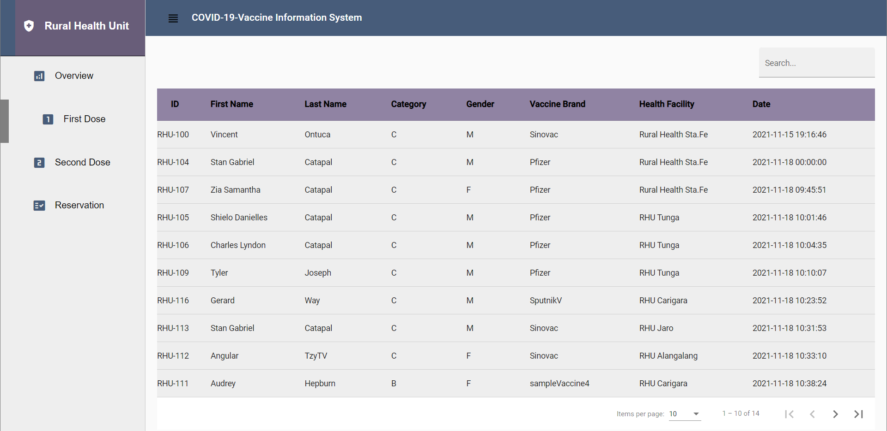
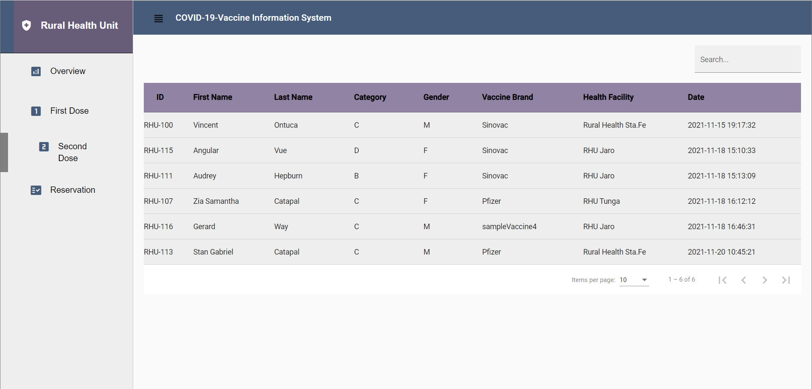
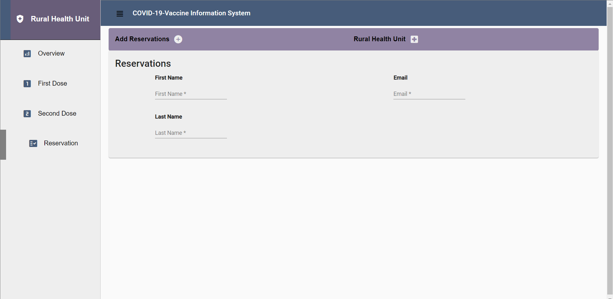

# Covid19 Vaccine Information System
This app is made using Angular Framwwork on Frontend, PHP in server-side and MySQL for database.
Features:
    There is two parts for this app the View where anyone can visit and an Admin Panel where only authorized user can access.
The View Part has an overview which sums up some report. The user can also see the list of people who have recieved First Dose and Second Dose. Lastly, any user can also make reservation by filling up his/her name and email address. If reservation is set an email will be sent.
#Screenshot for User's View

