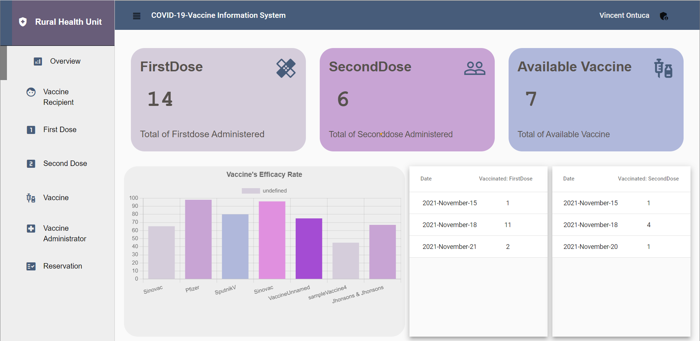
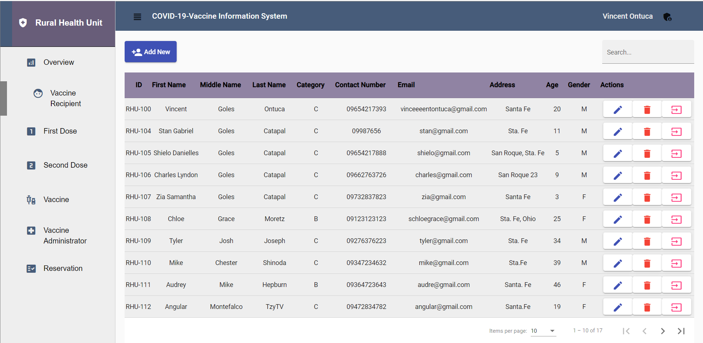
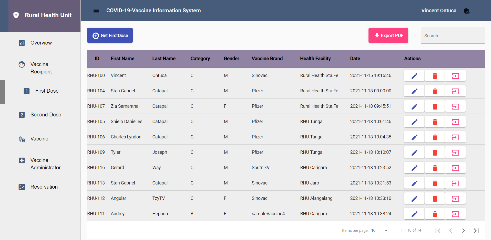
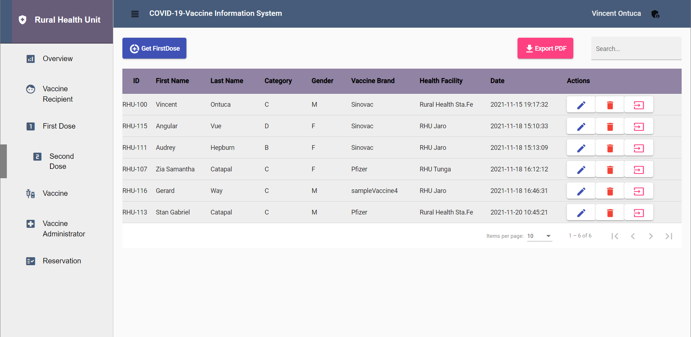
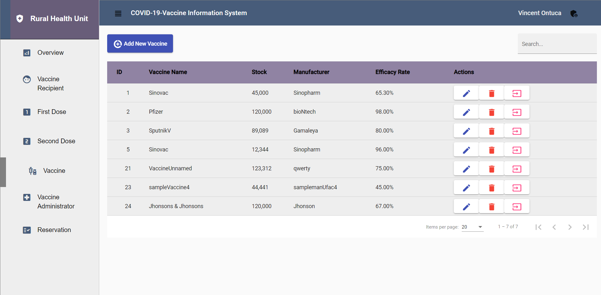
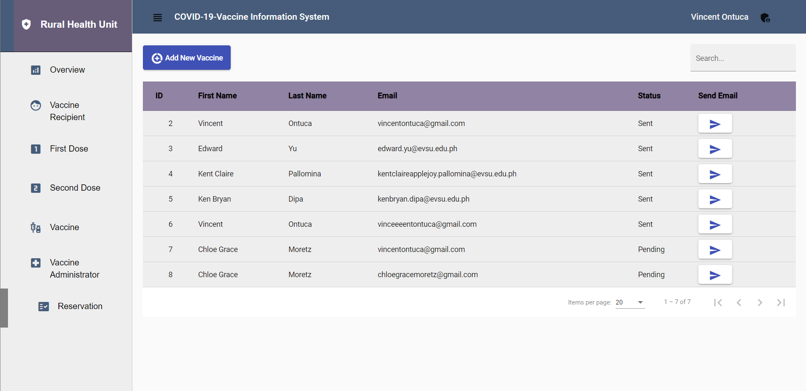
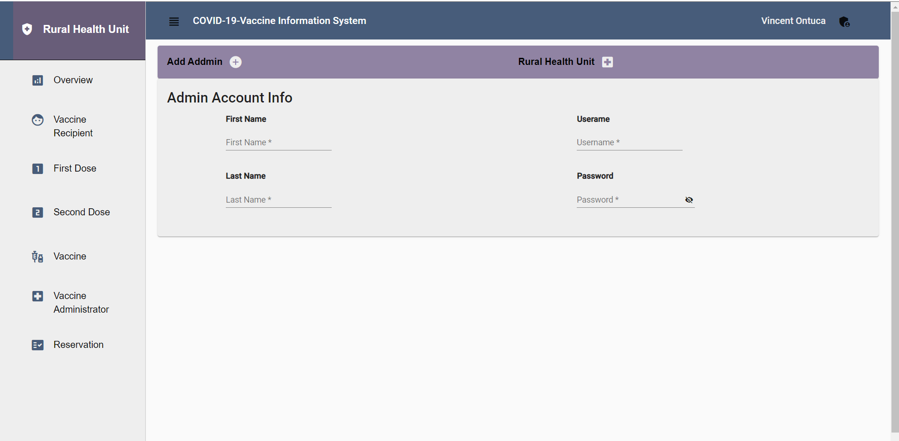

# Covid19 Vaccine Information System
This app is made using Angular Framwwork on Frontend, PHP in server-side and MySQL for database. 
Features: 
    There is two parts for this app the View where anyone can visit and an Admin Panel where only authorized user can access. 
    The app has an export pdf option that will generate report automatically 
    The app pages is protected by auth guard so unauthorized user cannot alter sensitive data. 
    The app has an send email where it notifies user that his/her reservation is already set. 
The View Part has an overview which sums up some report. The user can also see the list of people who have recieved First Dose and Second Dose.  Lastly, any user can also make reservation by filling up his/her name and email address.  If reservation is set an email will be sent.
<b>Screenshot for User's View</b> 
 
 
 
 
<b>The Admin Panel</b> 
Features 
    The admin has login authentication where only authorized person can access the app. 
    The admin can register person by taking personal info to be input. The admin can add person
    who will recieve Firstdose Second Dose.  The admin can send email to the user who made an reservation request. 
 
 
 
 
 
 
 

